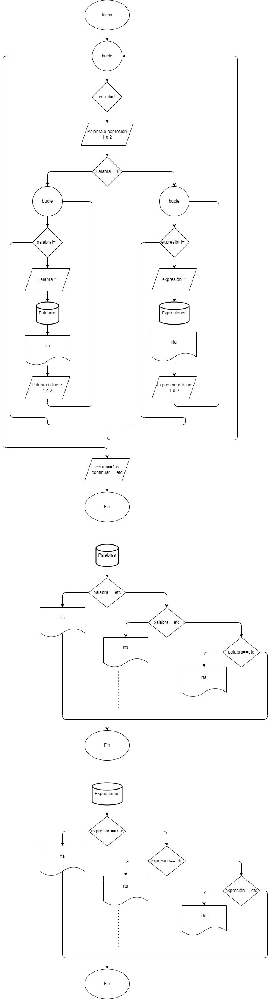

# Diccionario_coloquial
El objetivo de este proyecto es crear un diccionario de palabras y expresiones coloquiales donde tanto extranjeros como personas nativas puedan entender mejor al momento de tener una conversación.
## Diseño
### diagrama de flujo 

